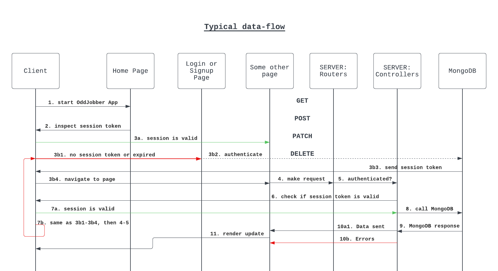
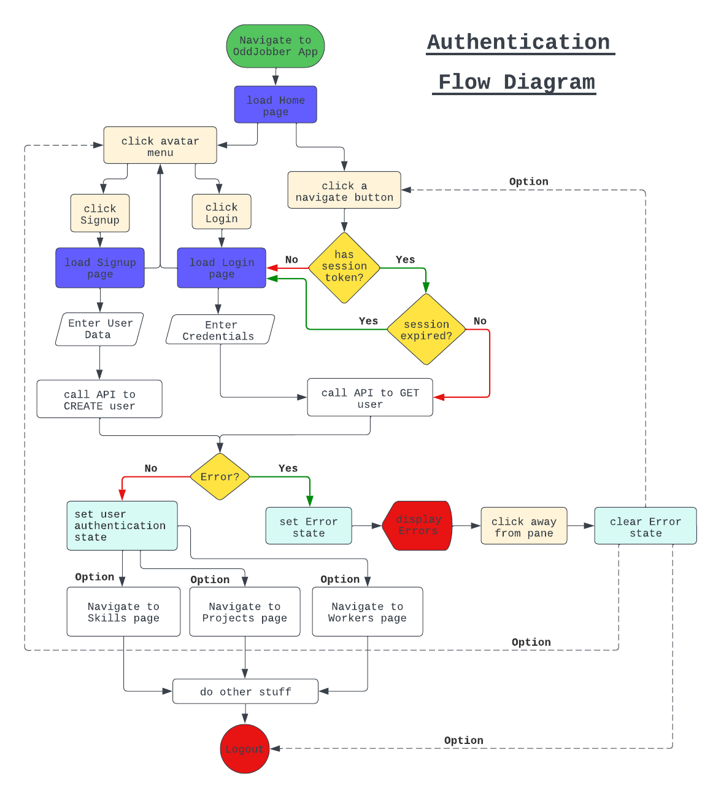
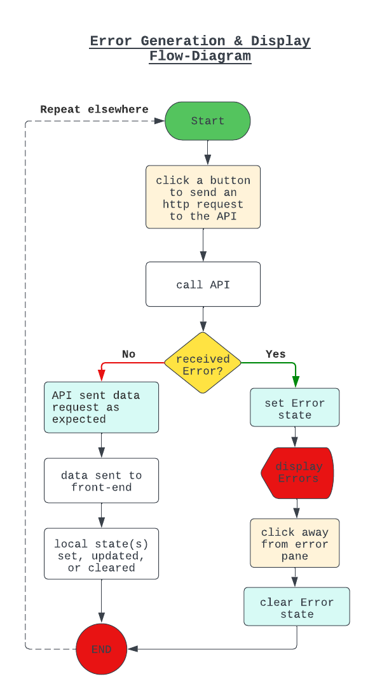
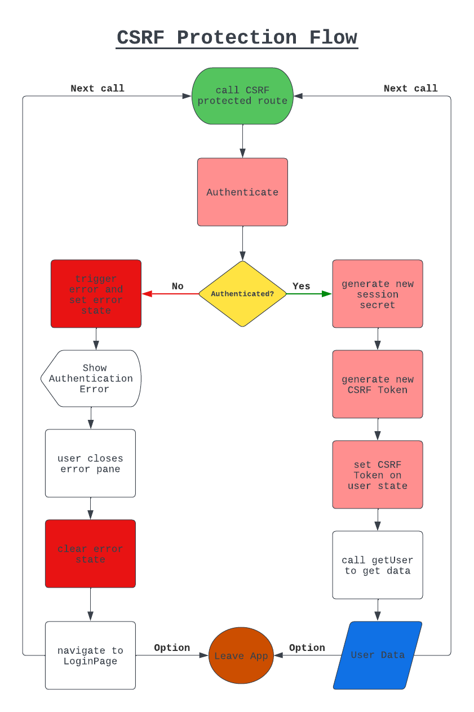
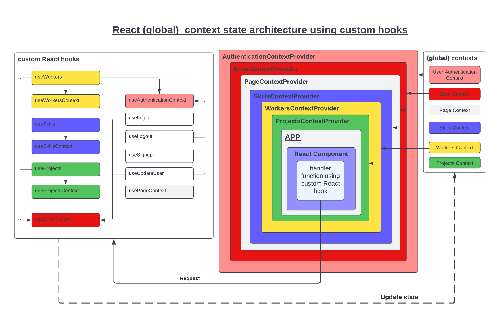
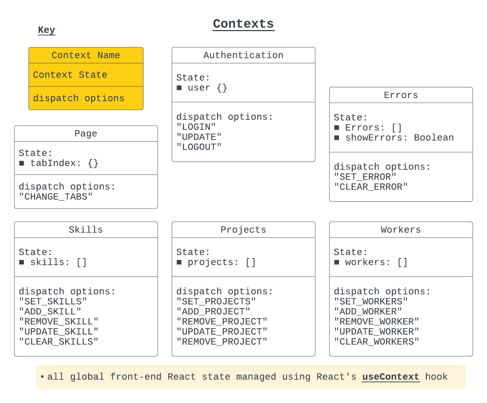
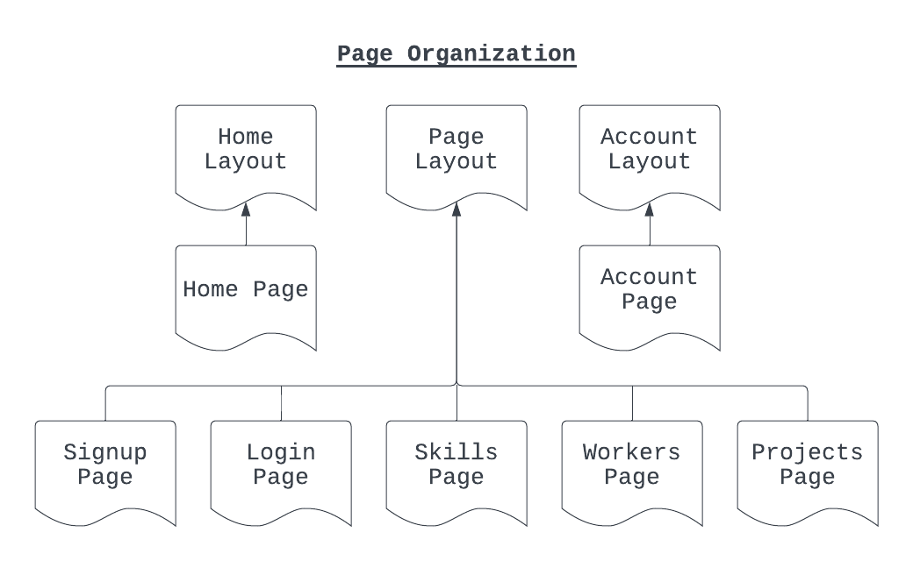
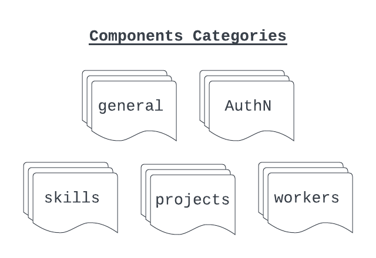

# The OddJobber App
You can run the app locally at [The OddJobber App](http://localhost:56000)

## Description

The OddJobber App is a skills crowd-sourcing application connecting homeowners and handymen.

### `User Registration`

Users register with a full name, email, username, and password. 
Optionally, a user can include a contact phone number and full address. 
Partial, or improper U.S. phone, state, or zipcodes are rejected.

### `Sessions & Security`

Users are logged-in for one hour at a time. Session timeout will trigger an error pane.
Once the pane is closed, the user is redirected to the login page. 
The App includes single factor authentication only.

### `Usage`

After registration, users can create projects and skills. 
Project creators are automatically assigned as project contacts. 
Minimally, other users will be able to see the project contact's email. 
Users may update their account with a phone number or address as desired.

Project creators are encouraged to connect with potential employees before adding them to their projects. 
There is no messaging mechanism in this iteration of the App to notify users when they have been added to a project. 
Skills cannot be updated or deleted after they are in use by a user or required as part of a project. 
The project contact (creator) can update the skills, workers, deadline, status, and project description. 

Workers assigned to a project have no control over the project. 
Workers must contact the project contact regarding any issues.

### `Payments & Legal`

There isn't a payment system in this version of the App. Workers set their expected hourly wage in their account settings. Payments and legal consequences have been abstracted away since this App is primarily for example purposes.

### `Account removal`

If a user decides to delete their account all associated projects they created are destroyed.

## Design

### `Overview`

The OddJobber App was built using the MERN stack. A MERN application consists
of a database tier (MongoDB), a backend server tier (Express JS, Node JS), and a frontend tier (React JS). 
The OddJobber App follows this design pattern. It is not an MVC (model-view-controller) design pattern. 
MVC serves backend web pages through a templating engine as a view. MERN organizes frontend code into React modules. 

### `MERN`

A set of technologies that include MongoDB, Express JS, React JS, and Node JS.
The MERN stack is used to create full-stack web applications with Javascript
as the common programming language for development.

- [MongoDB](https://www.mongodb.com/) 
- [Express](https://expressjs.com/) 
- [React](https://react.dev/) 
- [Node](https://nodejs.org/en);

## `Creating an error handling system`

### Initial Considerations

An MVC application that uses Express has the advantage of a built-in error handling mechanism. Since views
(pages) are served from the backend code, it is a simple matter of checking the data conditions returned by
the database of choice, and calling the 'next' function with the error object. The error handling routers
can then take over. A MERN application cannot send errors to the front end so easily since the front and backend
tiers are decoupled. Data is sent across the internet. An api such as fetch or Axios is required to retrieve
the data from the backend api server. So how was I accomplish that?

### How to show backend errors from the api in a user friendly format on the frontend ?

#### Custom Error Classes

The backend api was intentially designed to return either the data requested as JSON, or an appropriate error as JSON.
I had the option of using the native Javascript error object when throwing errors in the backend controllers,
but I wanted to make the calls self-documenting, faster to call, and reduce the amount of boiler plate code. Rather than
calling and sending `res.JSON({ error: 'some error message' })` each time I needed to throw an error, I created a
set of error classes using Javascript inheritence. The error classes sent the class name as the type, an HTTP response
code, and the error message. By using inheritance, I could later call the 'instanceof' method to validate if the error
was of a certain class type that I had defined. These checks occured in the error handling middleware function in the
backend server api. Specific formats were then chosen for each error case as JSON, and returned in the response object
of Express. Frontend data requests that resulted in an error would then be handling errors in a known format and as JSON.
A further benefit of the custom error classes, was that I could visually tell which error case would be set since they 
were self-documenting.

- [JSON](https://www.json.org/json-en.html)
- [instanceof](https://developer.mozilla.org/en-US/docs/Web/JavaScript/Reference/Operators/instanceof)

#### Input Sanitation & Validation

Handling most errors in the backend meant that I did not have to perform frontend input validation, since any failed requests
were interrupted on the backend either by the Mongoose validators, or in conditions tested for in the controllers. 
Data sanitation occurs from using MongoDB, since it parses every input as string data, and interally converts it. 
In most cases, there is no need to explicitly sanitize data in MongoDB as with an SQL type database system.

#### Structuring MongoDB Documents using `Mongoose`

SQL databases follow a strict data model defined by the table schema. A document such as a resume might require several
tables to store the data. The data is atomic in that each piece of information should not be repeated. Consistency across
the various tables must be `normalized` to ensure there is not redundancy, or wasted space. NO-SQL ()

- [Mongoose](https://mongoosejs.com/)

### Custom Javascript Error classes and the Express error handling function

I created several Javascript classes for custom errors using class inheritence.
Every class contained a static method in order to call in instance of itself. 
The Express error handler function was able to identify these various errors through 
the Javascript 'instanceof' method, and forward the error as JSON (Javascript-Object-Notation).

### Frontend Error State

React JS supplies a useContext hook which allows for the creation of global frontend state.
A context was created for errors in the frontend using the useContext hook. A React component
called ErrorPane displayed the errors to the user whenever the error context contained a
new value. The error context was set whenever error data was sent from the backend server.

### Detailed Error-flow Scenario `Failed create event`

Suppose a create operation is executed by a user. 
After the form is submitted, the request eventually goes to MongoDB where the request is made. 
Failed create events will throw an error that is catch-able in the controller code. 
The failed create is returned by Mongoose when the 'Model.create()' method is executed in the controller. 
A specific custom error is used to throw the error to the Express error handler. 
The Express error handler parses the error converting it into JSON. The JSON error is returned to the caller. 

On the frontend, the Javascript native fetch api was used to make the call. Checking the 'response.ok' field of the response object returned by the fetch api determines whether an error occured. The frontend global error context includes a method to update the global error state. By convention this is named 'dispatch'. 

The dispatch function is actually using another 'reducer' function declared within the error context which will check the type, 
and update the state object based on the type entered. 

The ErrorPane component is a child component to the error context provider which wraps the entire frontend React app. 
Children inherit the global properties of the error context provider, and can see the updated global state. 
The component watches for the state change using the React hook useEffect.

The change opens a panel on the left hand side of the screen populating the array of errors to the user. 
When the user clicks away from the panel, the dispatch fires again, this time clearing the global error state, and the panel is closed.

## `Styling`

Material UI (Mui), a Javascript library for React Components that follows Google's Material Design
specification was used to build most components. 

Mui version 5 has several mechanisms for customized component styling depending on the use case and specificity desired. Styles are backed by a company called Emotion. CSS (cascading-style-sheets), is included only in the required index.css file that was generated by Create-React-App.

- [Material UI](https://mui.com/) 
- [Emotion](https://emotion.sh/docs/introduction) 
- [Create-React-App](https://create-react-app.dev/)

# Documentation

## Flow-Diagrams

## Global State `React Context`

## Pages & Components

Every page used a layout component to structure the page as shown below:

### Authentication Components

- [AddUserSkillForm](./src/images/documentation/components/AuthN/AddUserSkillForm.png)
- [DeleteAccountForm](./src/images/documentation/components/AuthN/DeleteAccountFormForm.png)
- [ErrorPane](./src/images/documentation/components/AuthN/ErrorPane.png)
- [LoginForm](./src/images/documentation/components/AuthN/LoginForm.png)
- [SignupForm](./src/images/documentation/components/AuthN/SignupForm.png)
- [UpdateUserAttrsForm](./src/images/documentation/components/AuthN/UpdateUserAttrsForm.png)
- [UpdateUsernameForm](./src/images/documentation/components/AuthN/UpdateUsernameForm.png)
- [UpdateUserPasswordForm](./src/images/documentation/components/AuthN/UpdateUserPasswordForm.png)
- [UpdateUserPayRateForm](./src/images/documentation/components/AuthN/UpdateUserPayRateForm.png)

### General Components

- [CollapseWithButton](./src/images/documentation/components/general/CollapseWithButton.png)
- [CustomField](./src/images/documentation/components/general/CustomField.png)
- [DottedDivider](./src/images/documentation/components/general/DottedDivider.png)
- [LayoutGrid](./src/images/documentation/components/general/LayoutGrid.png)
- [ModalFormWrapper](./src/images/documentation/components/general/ModalFormWrapper.png)
- [Navbar](./src/images/documentation/components/general/Navbar.png)
- [PageNav](./src/images/documentation/components/general/PageNav.png)
- [RemoveButton](./src/images/documentation/components/general/RemoveButton.png)

### Project Components

- [AddProjectSkillForm](./src/images/documentation/components/projects/AddProjectSkillForm.png)
- [AddProjectWorkerForm](./src/images/documentation/components/projects/AddProjectWorkerForm.png)
- [CreateProjectForm](./src/images/documentation/components/projects/CreateProjectForm.png)
- [Project](./src/images/documentation/components/projects/Project.png)
- [ProjectContents](./src/images/documentation/components/projects/ProjectContents.png)
- [ProjectSearch](./src/images/documentation/components/projects/ProjectSearch.png)
- [ProjectStatus](./src/images/documentation/components/projects/ProjectStatus.png)
- [UpdateProjectForm](./src/images/documentation/components/projects/UpdateProjectForm.png)

### Skills Components

- [Skill](./src/images/documentation/components/skills/Skill.png)
- [SkillForm](./src/images/documentation/components/skills/SkillForm.png)
- [SkillLevel](./src/images/documentation/components/skills/SkillLevel.png)
- [SkillSearch](./src/images/documentation/components/skills/SkillSearch.png)
- [SkillsTable](./src/images/documentation/components/skills/SkillsTable.png)
- [UpdateSkillForm](./src/images/documentation/components/skills/UpdateSkillForm.png)

### Workers Components

- [AddressTable](./src/images/documentation/components/workers/AddressTable.png)
- [PayRate](./src/images/documentation/components/workers/PayRate.png)
- [UserContact](./src/images/documentation/components/workers/UserContact.png)
- [Worker](./src/images/documentation/components/workers/Worker.png)
- [WorkerSearch](./src/images/documentation/components/workers/WorkerSearch.png)
- [WorkersTable](./src/images/documentation/components/workers/WorkersTable.png)

